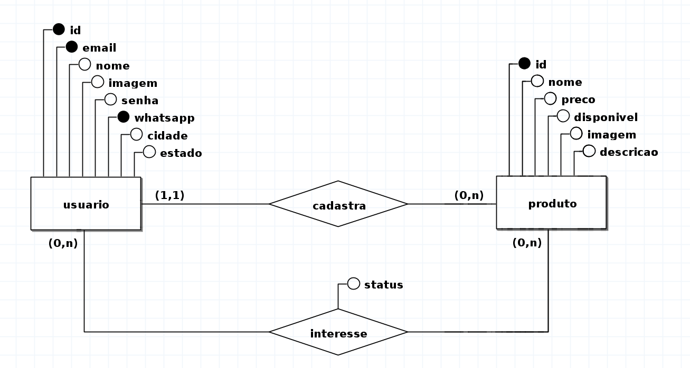

# 🛒 Marketplace - Conectando Vendedores e Compradores

Este é um projeto de **Marketplace** que conecta vendedores e compradores sem intermediação de pagamentos. A negociação ocorre diretamente entre os usuários via WhatsApp.

## 🚀 Tecnologias Utilizadas

- **Back-end:** Node.js, Express, Prisma ORM, SQLite (para desenvolvimento)
- **Front-end:** Next.js, TypeScript, Tailwind CSS
- **Banco de Dados:** PostgreSQL (produção) ou SQLite (desenvolvimento)

## 📌 Funcionalidades

### 1️⃣ Cadastro e Autenticação
- Usuário pode **criar conta, fazer login e atualizar perfil**.
- Campos: **Nome, Email, Senha, WhatsApp, Cidade, Estado**.

### 2️⃣ Gerenciamento de Produtos
- Usuário pode **cadastrar produtos** com:
  - Nome, descrição, preço, **categoria** e **imagem única**.
  - Status de disponibilidade (**disponível/vendido**).
- Usuário pode **editar ou remover** produtos.

### 3️⃣ Sistema de Interesse
- Usuários podem **demonstrar interesse** nos produtos.
- **Lista de interessados** visível para o dono do produto.
- Cada interesse possui um **status**, que pode ser:
  - `pending` (pendente) → Interesse recém-registrado, aguardando ação do vendedor.
  - `accepted` (aceito) → Vendedor aceitou o interesse do comprador.
  - `rejected` (rejeitado) → Vendedor recusou o interesse do comprador.

### 4️⃣ Contato via WhatsApp
- Cada produto terá um botão para **abrir o WhatsApp** do vendedor.

### 5️⃣ Categorias
- Produtos são organizados por **categorias** para facilitar a busca.

### 6️⃣ Filtros e Busca
- Busca por **nome, categoria e localização**.

### 7️⃣ Destaques
- Listagem de produtos **mais visualizados ou recentes**.

## 🛠️ Banco de Dados

### **DER - Diagrama Entidade-Relacionamento**
 

